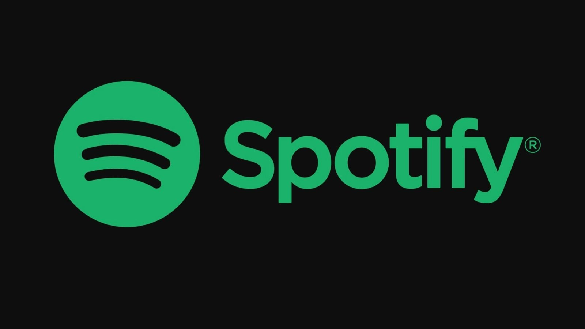

<h1 align="center">
	
</h1>

<h3 align="center">Spotify: Simple Copy</h3>

<p align="center">
  
  
</p>

<p align="center">
  

  

  

  
</p>

<p align="center">
  <a href="#rocket-about-the-challenge">About the Project</a>&nbsp;&nbsp;&nbsp;
  |&nbsp;&nbsp;&nbsp;<a href="#electric_plug-how-to-use">How to Use</a>
  &nbsp;
  |&nbsp;&nbsp;&nbsp;<a href="#memo-license">License</a>
</p>

## :rocket: About the Project

\*This project is still under construction, but it is possible to do some actions and get a sense of its interface.

Possible actions are:

1. Create a new Playlist.

2. Access Routes

3. Viewing Albums and Animations\*

## :electric_plug: How to use

So when this project is cloned on your machine, it is necessary to install its modules using the package manager `YARN`...
If you do not have `YARN` properly installed on your machine, [access this link](https://yarnpkg.com/) to download and install...
If you already have `YARN` installed, open `terminal` (linux) or `cmd` (windows) at the root of the project where the `package.json` file is located and run the following command:

```
yarn
```

After that, `YARN` will install all the project dependencies for you...
The second step is to start the "backend" (Json-Server) of the project, for this I have already prepared a command in the script of the file `package.json`, just just run the following command:

```
yarn start_backend
```

Finally, we can start the project with the following command:

```
yarn start
```

## :memo: License

This project is under the GNU license. See the [LICENSE](LICENSE) for more details..

---

Made with ♥ and with the intention of learning and passing on knowledge. 👋
